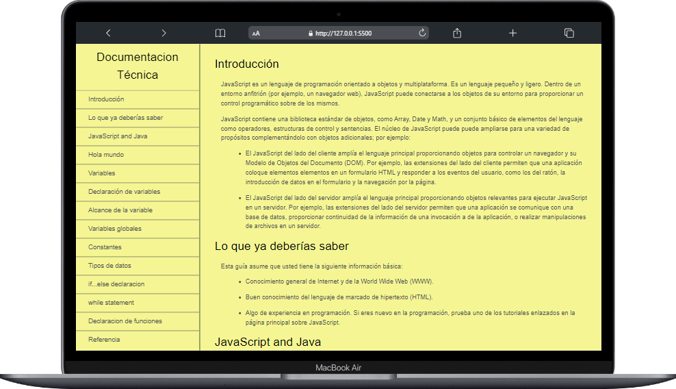

# Documentación Técnica sobre JavaScript

## Introducción

Esta documentación técnica en HTML y CSS proporciona información detallada sobre el JavaScript, que contine informacion importante para guiar a quien lo visitem en los conceptos importantes de este lenguaje de programación.

## Tabla de Contenidos

- [Documentación Técnica sobre JavaScript](#documentación-técnica-sobre-javascript)
  - [Introducción](#introducción)
  - [Tabla de Contenidos](#tabla-de-contenidos)
  - [Descripción](#descripción)
  - [Capturas de Pantalla](#capturas-de-pantalla)
  - [Demo en Vivo](#demo-en-vivo)
  - [Tecnologías Utilizadas](#tecnologías-utilizadas)
  - [Instalación](#instalación)
  - [Configuración](#configuración)
  - [Uso](#uso)
  - [Características](#características)
  - [Contribución](#contribución)

## Descripción

En esta documentación técnica se puede encontrar información relevante sobre JavaScript,donde se explica que es, para que sirve, como se utiliza, entre otros aspectos importantes.

## Capturas de Pantalla

<div align="center">
    
</div>

## Demo en Vivo

Para ver la demo en vivo de este proyecto, puedes visitar [Demo](https://kevinrivera1.github.io/Documentacion-Tecnica-HTML-CSS/).

## Tecnologías Utilizadas

- Html
- Css

## Instalación

Para usar **AGRISOFT** en tu propio entorno, sigue estos pasos:

1. Clona este repositorio en tu máquina local:

   ```bash
   git clone https://github.com/KevinRivera1/Documentacion-Tecnica-HTML-CSS.git
    ```

2. Abre el proyecto en tu editor de código favorito.
3. Abre el archivo `index.html` en tu navegador.
4. ¡Disfruta! 🎉

## Configuración

No requiere de ninguna configuración adicional.

## Uso

Debes tener en cuenta que para poder visualizar la documentación técnica debes tener un navegador web instalado en tu computadora, ya sea Google Chrome, Mozilla Firefox, Microsoft Edge, entre otros.

## Características

- Información detallada sobre JavaScript.
- Información sobre los conceptos básicos de JavaScript.
- Información sobre los conceptos avanzados de JavaScript.

## Contribución

¡Te invitamos a contribuir a nuestro proyecto! Si deseas colaborar, por favor sigue estos pasos:

1. Fork este repositorio.
2. Crea una rama (branch) con un nombre descriptivo.
3. Realiza tus cambios y mejoras en la nueva rama.
4. Abre una solicitud de extracción (pull request) para que revisemos tus contribuciones.